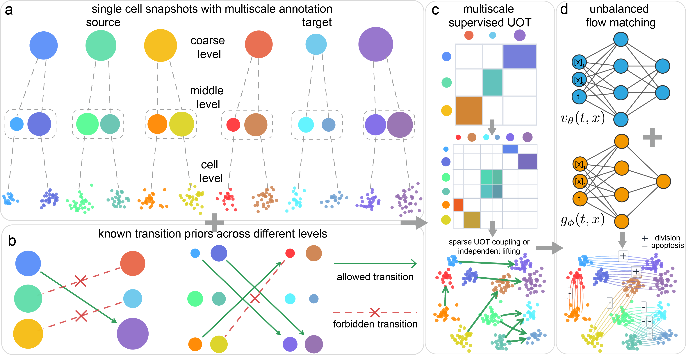

# Multiscale Supervised Unbalanced Optimal Transport Flow Matching (MUST-FM)

<p align="center">
Enjoying MUST-FM? Help us grow by clicking the ⭐ button!
</p>



## Installation

- Python = 3.10

```bash
conda create -n MOST python=3.10
conda activate MOST

pip install -r requirements.txt
```

## Structure

- `src/`: training and evaluation code
- `data/`: datasets used by the release scripts
- `results/`: packaged checkpoints and run outputs

## Dataset

The processed datasets used in MUST-FM can be downloaded from https://zenodo.org/records/20095042

## Training MUST-FM

MUST-FM uses a flexible configuration system, where users can specify the parameters used to train MUST-FM. The configurations are stored in the `src/experiment_configs.py`.

To train MUST-FM on your own dataset, you need to convert your own dataset to a csv file and store it in the `data/` folder. Specifically, the column `samples` refers to the biological time points starting from time 0, and it is recommended to normalize the time scales to a reasonable range. The following columns, starting from `x1`, refer to the gene expression features. The columns starting from `scale0` denote the multiscale annotation, while the columns starting from `prior0` denote the biological transition priors. The optional column `cell_weight` means the weight of each cells. 

After the dataset is prepared, add these parts in the confuguration file `src/experiment_configs.py`:

```yaml
"<your_data_name>": ExperimentConfig(
        experiment_name="<your_data_name>",
        data_file="data/<your_data_name>.csv",
        dim=<your_data_dimention>,
        delta=<n>,
        independent=<True/False>,
        use_supervised_prior=<True/False>,
    ),
```

- `delta` varies in the range [0,inf], The larger it is, the more it inhibits growth and tends toward unbalance; the smaller it is, the more it favors growth and may inhibit transport.

- `independent` option enables the scalable independent coupling lifting strategy at the finest level. Set `True` for atlas-scale datasets, and `False` for exact sparse UOT coupling.

- `use_supervised_prior` option controls whether supervised biological priors are used to constrain feasible transport pairs. Set it to `True` when prior labels are available.

For example, to reproduce our results on the Mouse Blood Hematopoiesis dataset, set:

```yaml
"weinreb_2d": ExperimentConfig(
        experiment_name="weinreb_2d",
        data_file="data/Weinreb_2d.csv",
        dim=2,
        delta=15.0,
        batch_size=512,
        independent=False,
        use_supervised_prior=False,
    ),
```

Then, create a python file `src/train_<your_data>.py` to train MUST-FM on your own dataset:

```yaml
from experiment_configs import EXPERIMENTS
from experiment_runner import run_experiment

if __name__ == "__main__":
    run_experiment(EXPERIMENTS["<your_data_name>"])
```

For example, to reproduce our results on the Mouse Blood Hematopoiesis dataset, create:

```yaml
from experiment_configs import EXPERIMENTS
from experiment_runner import run_experiment

if __name__ == "__main__":
    run_experiment(EXPERIMENTS["weinreb_2d"])
```

For training, simply run  `train_<your_data>.py`:

```bash
python train_<your_data>.py
```

For example, to reproduce our results on the Mouse Blood Hematopoiesis dataset, run:

```bash
python train_weinreb.py
```

**If you encounter  `CUDA out of memory` error, you may set the parameters `independent` to `True`.**

## Evaluation

After training, the performance of distribution matching and mass matching will be automatically evaluated using $\mathbf{W}_1$ and $RME$. (more information about the metrics can be found in WFR-FM)

## How to cite

If you find this package helpful in your research, we would greatly appreciate it if you could consider citing our following work.

- Qiangwei Peng, Lezhi Chen, Peijie Zhou. “Multiscale Supervised Unbalanced Optimal Transport Flow Matching”. In: *arXiv:2605.16529*.

These papers present the core algorithm on which this package is built, as well as other relevant developments.

- Qiangwei Peng, Zihan Wang, Junda Ying, Yuhao Sun, Qing Nie, Lei Zhang, Tiejun Li, Peijie Zhou. “WFR-FM: Simulation-Free Dynamic Unbalanced Optimal Transport”. In: *ICLR 2026*.

- Qiangwei Peng, Peijie Zhou, and Tiejun Li. “stVCR: Spatiotemporal dynamics of single cells”. In: *Nature Methods*.

## Contact information

If you encounter any issues while running the code, please feel free to contact us and we warmly welcome any discussions and suggestions:

Qiangwei Peng (qiangweipeng123@gmail.com), Lezhi Chen (chenlezhi_scu@outlook.com)
